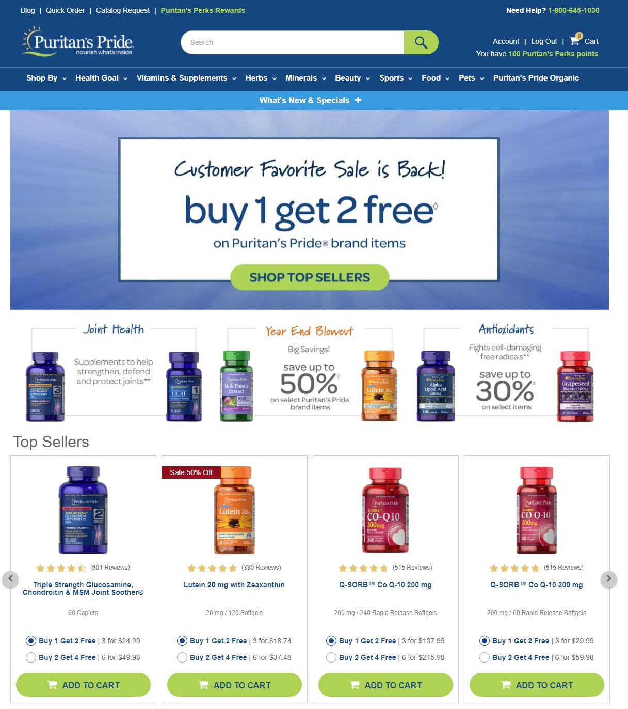
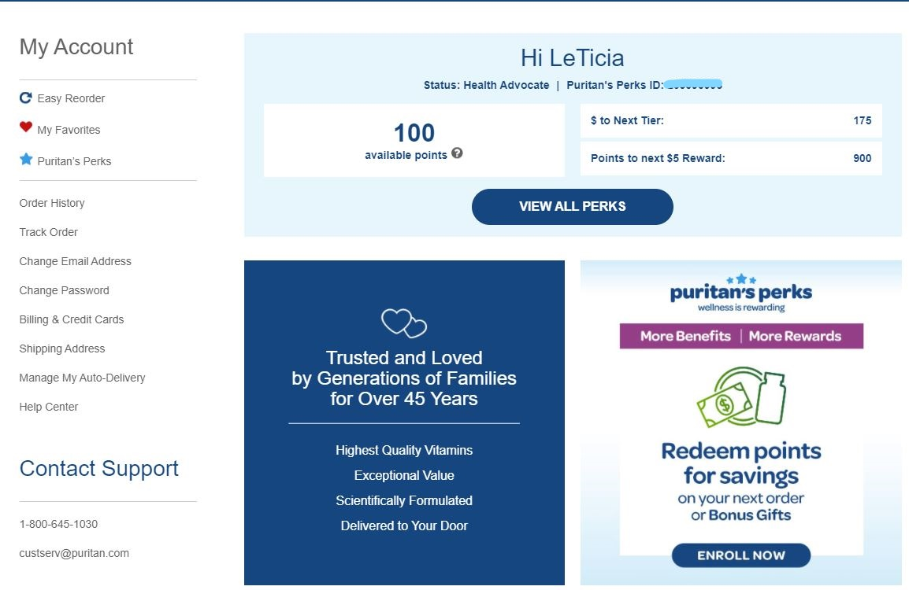

```{r setup, include=FALSE}
knitr::opts_chunk$set(echo = TRUE)
```

## Recommender System

The recommender system I will analyze is [Puritan’s Pride](https://www.puritan.com/). It is an online store that sells herbs and supplements. 




### Scenario Design Analysis:

1. Who are the target users?

The target users are individuals who take supplements and want to purchase them in bulk for a bargain price. 

2. What are their key goals?

Their goal is to provide supplements made with high quality ingredients for a price that will not break the bank. Their goal is also to create a loyal customer base so they will continue to shop at Puritan’s Pride when it is time to restock on supplements. 

3. How can you help them accomplish those goals?

I think this company has a great variety of supplements for different types of health concerns, but I think they should have something that is more tailored to the individual customer. I would modify the user profile to allow the user to include specific information about their health goals and lifestyle so they can receive email recommendations for products based on how they set up their profile. 



### Reverse Engineer Site

E-commerce  recommender systems work with an algorithm called “collaborative filtering”^1^. Collaborative filtering takes data from many users and looks for patterns. These patterns can be matched to a new user to help predict what the user is interested in. Since the product being sold on this site is supplements there is a higher demand for certain items based on the season. For example, cold and flu season is approaching so the website is going to promote supplements that help to build the immune system. 

  

### Recommendations

Puritan’s Pride has a blog section with lots of useful information related to health and supplements^2^. I am a user of this site and the emails I receive are related to the current promotions, but blog posts are not included in the email. As a customer I would be interested in receiving blog posts in my inbox based on supplements that are important to me. 

  

### Sources

1. [Top e-commerce recommender systems](https://bestpersonalizationservices.com/top-ecommerce-recommender-systems/)

2. [Puritan’s Pride Blog](https://www.puritan.com/blog)

